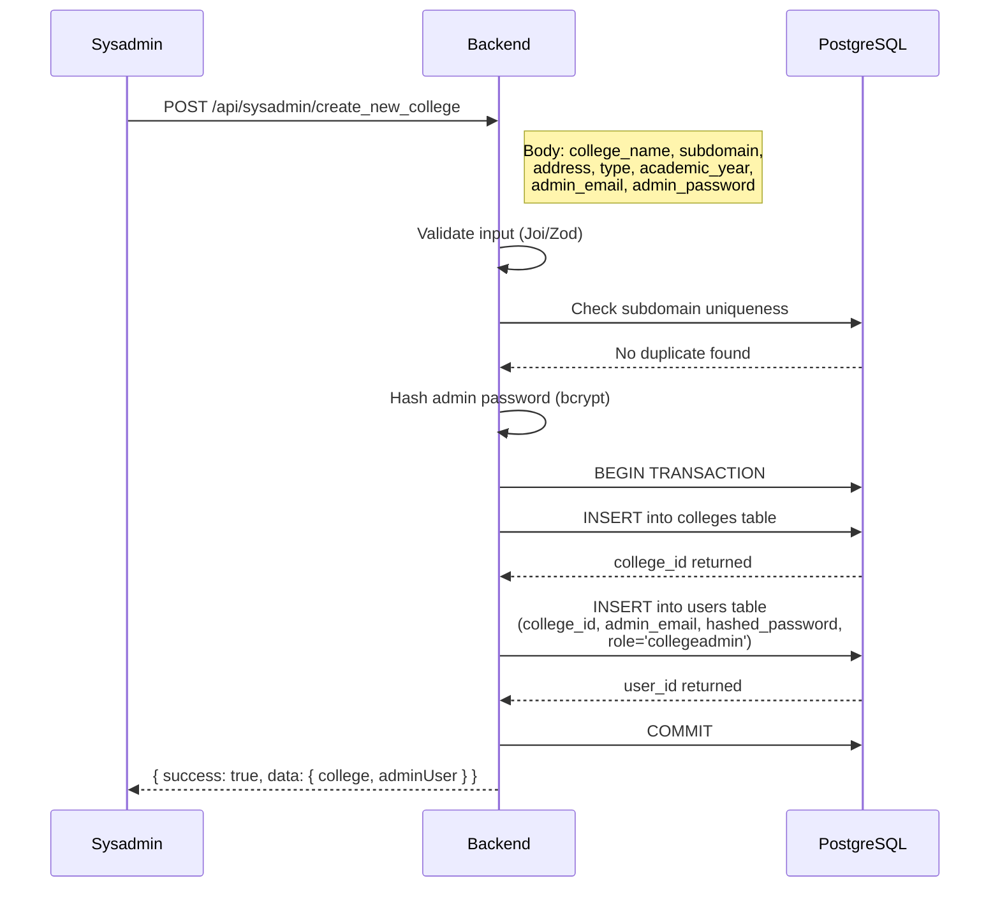
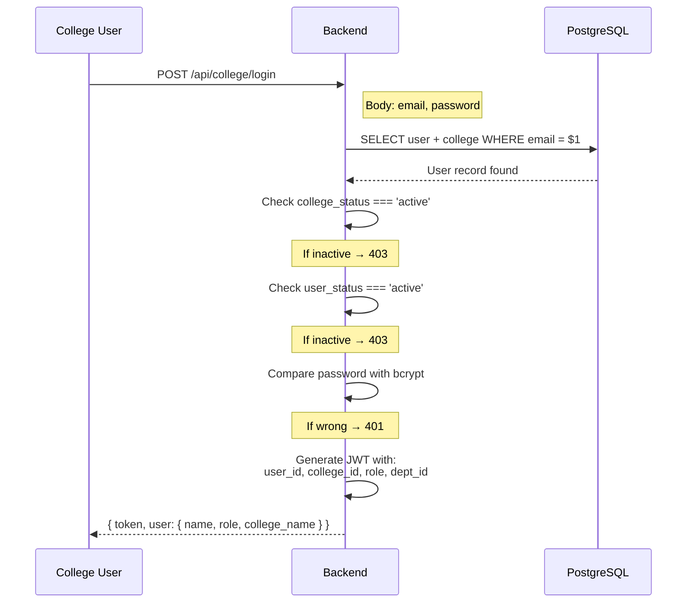
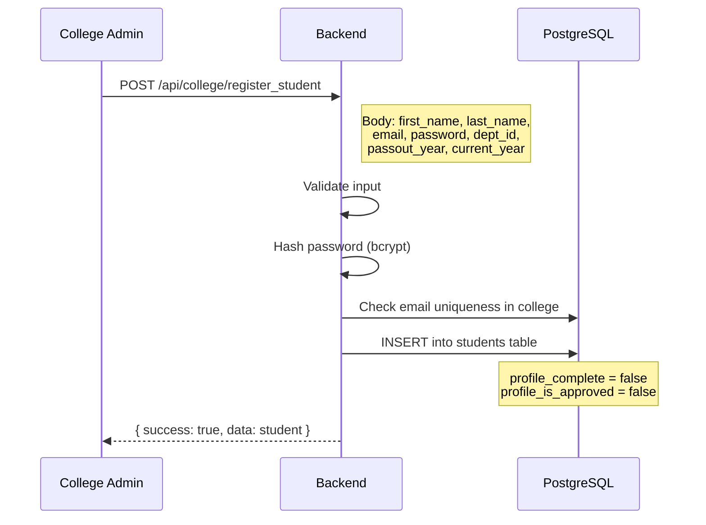
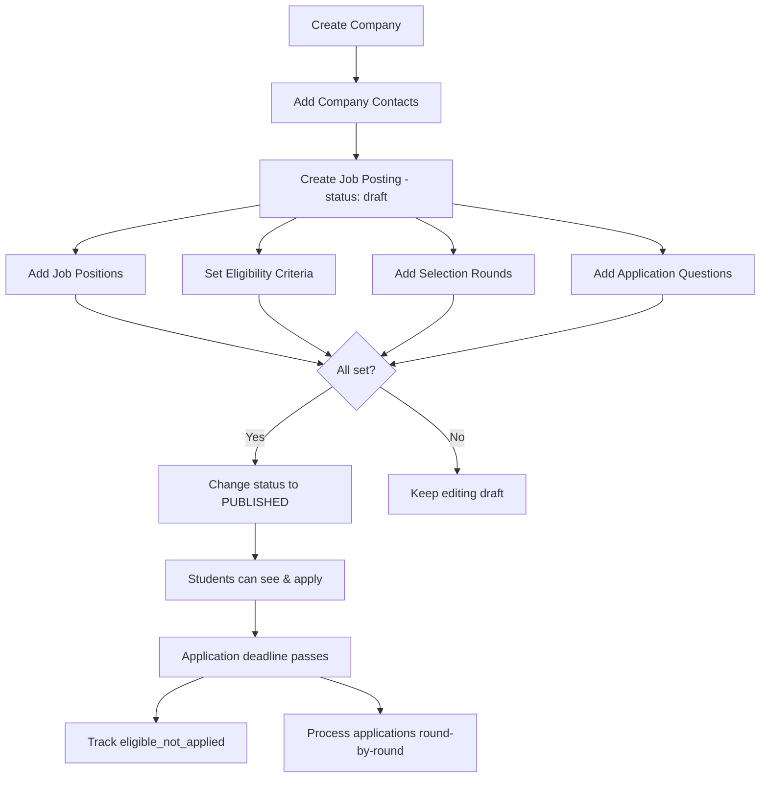
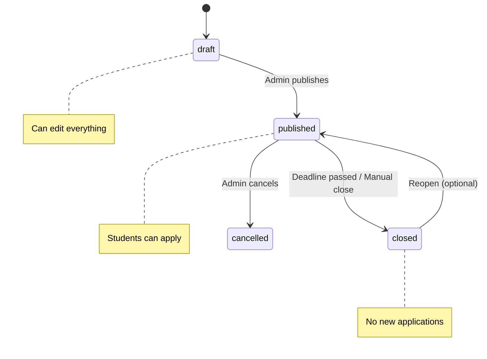
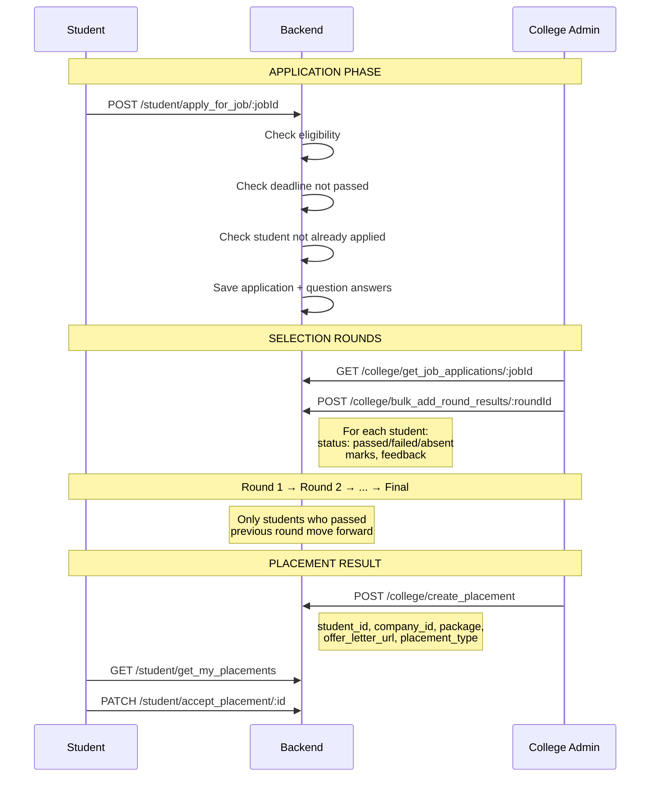
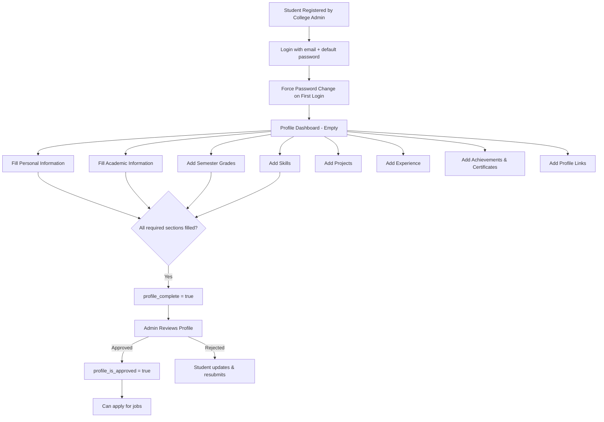
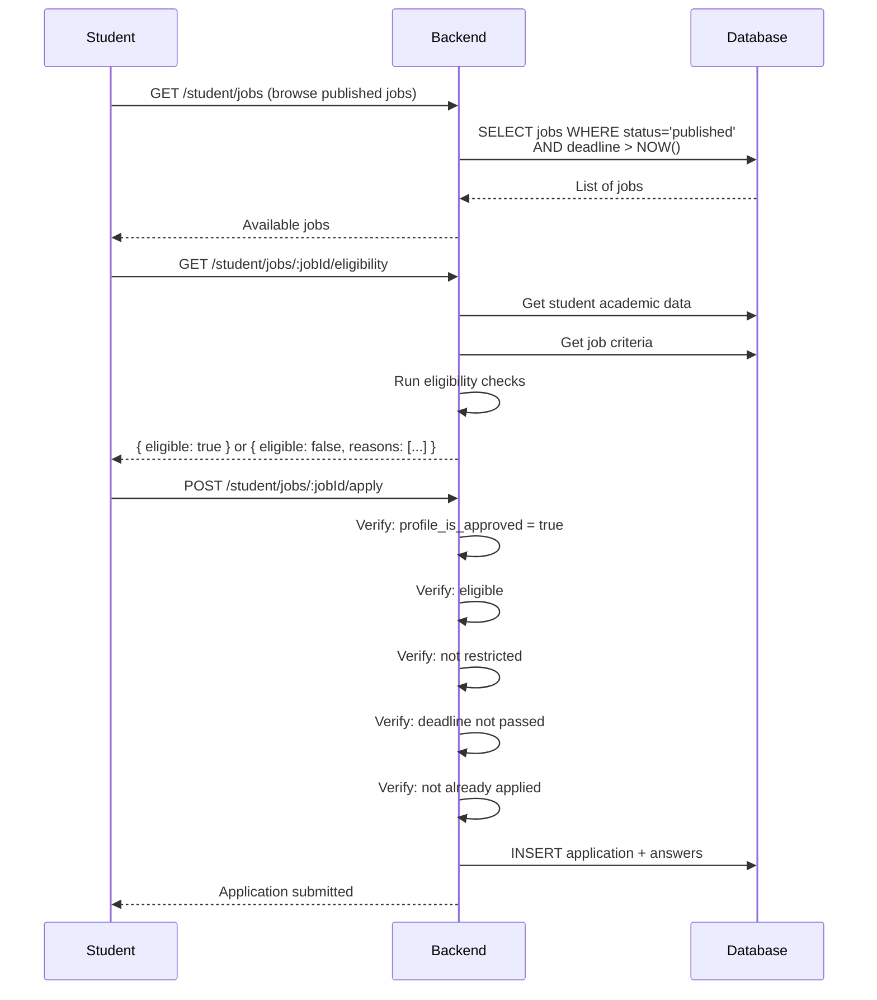

# Placement CRM — Complete Backend Flow Document 2.0

> **Stack**: Node.js + Express.js + PostgreSQL (Supabase)
> **Auth**: JWT (college users + students) | .env credentials (sysadmin)

---

## 📂 Project Structure

```
src/
├── config/
│   ├── constants.js            # All enums, messages, config values
│   ├── db.js                   # PostgreSQL pool (getMainPool)
│   ├── logger.js               # Winston logger setup
│   └── rateLimiter.js          # authLimiter + apiLimiter
├── middleware/
│   ├── authMiddleware.js       # JWT verify + requireRole
│   └── validateRequest.js      # Joi validation middleware
├── routes/
│   ├── index.js                # Route aggregator
│   ├── sysadmin/               # Sysadmin routes
│   ├── college/                # College admin routes
│   └── student/                # Student routes
├── controllers/                # Request handlers (HTTP layer)
├── services/                   # Business logic + DB queries
├── validators/                 # Joi schemas
├── utils/
│   ├── responseHelper.js       # { success, data, message } format
│   └── pagination.js           # Page, limit, offset, total
├── app.js                      # Express app setup
└── server.js                   # Listen on PORT
```

---

## 🔐 Things to Keep in Mind (Best Practices)

### 1. Standardized API Response
Every API must return the same shape:
```js
// Success
{ success: true, data: {...}, message: "College created successfully" }

// Error
{ success: false, error: "Validation failed", details: [...] }

// List with pagination
{ success: true, data: [...], pagination: { page: 1, limit: 10, total: 250 } }
```

### 2. Authentication & Authorization Flow
```
Request → authMiddleware (verify JWT)
        → roleMiddleware (check user_role)
        → collegeIsolation (inject college_id from token)
        → Controller
```

> [!IMPORTANT]
> **Every query MUST include `college_id` in the WHERE clause.** This is the foundation of multi-college isolation. Never allow one college to see another college's data.

### 3. Input Validation (BEFORE touching DB)
- Use **Joi** or **Zod** to validate every request body, params, and query
- Validate UUIDs, emails, phone numbers, dates, enum values
- Return 400 with clear error messages if validation fails
- **Never trust frontend data** — always validate on backend

### 4. Password Handling
- Hash passwords with **bcrypt** (salt rounds: 10-12)
- Never store plain text passwords
- Never return passwords in API responses (use `SELECT` without password field)

### 5. Pagination on All List APIs
- Default: `page=1, limit=10`
- Always return `{ data, pagination: { page, limit, total, totalPages } }`
- Use `OFFSET` and `LIMIT` in SQL queries

### 6. Error Handling
- Have a global error handler middleware
- Return proper HTTP status codes: 200, 201, 400, 401, 403, 404, 409, 500
- Log errors with `err.message` + `err.stack` (never just `err` as string)
- Don't expose internal errors to client

### 7. SQL Injection Prevention
- Always use **parameterized queries** (`$1, $2, $3...`)
- Never concatenate user input into SQL strings

### 8. Documents (Resume, Offer Letters, Certificates)
- **No file uploads** — all documents stored as URL links
- User provides hosted link (Google Drive, etc.) and we save the URL in database
- This applies to: offer letters, resumes, certificates, project links, profile photos

### 9. Soft Delete vs Hard Delete
- Prefer **status change** (`is_active = false`, `student_status = 'inactive'`) over deletion
- Only hard delete where it makes sense (draft questions, temp data)

### 10. Transaction Usage
- Use **database transactions** when inserting into multiple tables
- Example: Creating a job posting (job_postings + job_positions + job_eligibility_criteria + job_rounds) → all or nothing

---

## 🔴 SECTION 1: SYSADMIN FLOW

### How Sysadmin Auth Works
```
┌──────────────────────────────────────────────────┐
│ Sysadmin credentials stored in .env file:        │
│   SYSADMIN_EMAIL=admin@system.com                │
│   SYSADMIN_PASSWORD=hashed_password_here         │
│                                                  │
│ POST /api/sysadmin/login                         │
│   → Compare email + password with .env values    │
│   → If match → return JWT with role: 'sysadmin'  │
│   → If not → return 401                          │
│                                                  │
│ All sysadmin routes use sysadminAuth middleware   │
│   → Verify JWT + check role === 'sysadmin'       │
└──────────────────────────────────────────────────┘
```

### Flow: Creating a College



> [!IMPORTANT]
> **When creating a college, also create the first college admin user** in a single transaction. This is the user who will log in and manage everything for that college.

### College Status Management
```js
// PATCH /api/sysadmin/toggle_college_status/:collegeId
// Body: { status: "inactive" }

// When college is deactivated:
// 1. Update college_status = 'inactive'
// 2. All college users and students should NOT be able to login
//    → Check college_status in login APIs
//    → If college is inactive → return 403 "College account is deactivated"
```

### Enabled Features
```js
// PATCH /api/sysadmin/update_college_features/:collegeId
// Body: { features: ["core", "training", "feedback", "interview_questions"] }

// Store as JSONB array in colleges.enabled_features
// College admin can only access features that are enabled
// → Check features in middleware or at route level
```

---

## 🟢 SECTION 2: COLLEGE ADMIN FLOW

### College User Login Flow



> [!IMPORTANT]
> **JWT Payload must contain**: `user_id`, `college_id`, `role`, `dept_id` (if applicable). The `college_id` is used in EVERY subsequent query for data isolation.

### Forgot Password Flow
```
1. POST /forgot-password → { email }
2. Find user by email → if exists, generate reset token (UUID or JWT with 15min expiry)
3. Save token hash in DB or in-memory (Redis)
4. Send email with reset link: https://app.com/reset-password?token=xxx
5. POST /reset-password → { token, new_password }
6. Verify token → hash new password → update in DB → delete token
```

### Department Management

```
POST /api/college/departments → { dept_name, dept_code, dept_type, program_duration_years, total_semesters }

// Key points:
// 1. Always include college_id from JWT token (don't accept from body)
// 2. Check uniqueness: same dept_name should not exist in same college
// 3. program_duration_years and total_semesters are important for semester grading
//    e.g. Engineering = 4 years, 8 semesters | Diploma = 3 years, 6 semesters
```

### Student Registration Flow



#### Bulk Registration Flow
```
POST /api/college/bulk_register_students

// Frontend parses Excel/CSV → sends JSON array to backend
// NO file upload — data comes as JSON in request body

Body: {
  students: [
    { first_name, last_name, email, dept_id, passout_year, current_year },
    { first_name, last_name, email, dept_id, passout_year, current_year },
    ...
  ]
}

1. Validate each student object in the array
2. Check email uniqueness for each
3. Generate default passwords (e.g., firstname@passout_year → "rahul@2025")
4. Hash all passwords
5. Use BATCH INSERT (single query with multiple VALUES)
6. Return:
   - success_count: how many created
   - failed_rows: [{ index: 2, error: "Email already exists" }]
   - credentials: [{ email, default_password }] — for admin to share
```

> [!TIP]
> For bulk insert, use PostgreSQL's `INSERT INTO students (...) VALUES ($1..), ($2..), ($3..)` — much faster than inserting one-by-one.

### Student List API — Year-Based Filtering

```js
// GET /api/college/students?passout_year=2025&dept_id=xxx&status=active&page=1&limit=10

// IMPORTANT: How passout_year works:
// 1. Frontend initially loads with college's default_academic_year
// 2. If user wants previous year data → they select year from dropdown
// 3. Backend always filters by passout_year

// Query:
SELECT s.*, d.dept_name
FROM students s
JOIN departments d ON s.dept_id = d.dept_id
WHERE s.college_id = $1              -- ALWAYS from JWT
  AND s.student_passout_year = $2    -- from query param (default = college's default_academic_year)
  AND ($3::uuid IS NULL OR s.dept_id = $3)     -- optional dept filter
  AND ($4::text IS NULL OR s.student_status = $4)  -- optional status filter
ORDER BY s.first_name ASC
LIMIT $5 OFFSET $6;
```

### Student Profile Approval Flow

```
When student completes profile:
  → Student sets profile_complete = true from their side

When college admin reviews:
  → GET /students/:id/full-profile  (see all student data across all tables)
  → PATCH /students/:id/approve-profile  
    → Body: { is_approved: true }  OR  { is_approved: false, reason: "..." }

Only students with profile_is_approved = true should be eligible for job applications.
```

### Company + Job Posting Workflow



### Creating a Job Posting (Transaction)

```js
// POST /api/college/create_job — Create everything together

// This should be a TRANSACTION because we're inserting into multiple tables:

async function createJobPosting(data, collegeId) {
  const mainPool = getMainPool();
  const client = await mainPool.connect();
  try {
    await client.query('BEGIN');

    // 1. Insert job posting
    const job = await client.query(
      'INSERT INTO job_postings (...) VALUES (...) RETURNING job_id', [...]
    );
    const jobId = job.rows[0].job_id;

    // 2. Insert positions (loop)
    for (const pos of data.positions) {
      await client.query(
        'INSERT INTO job_positions (job_id, ...) VALUES ($1, ...)', [jobId, ...]
      );
    }

    // 3. Insert eligibility criteria
    await client.query(
      'INSERT INTO job_eligibility_criteria (job_id, ...) VALUES ($1, ...)', [jobId, ...]
    );

    // 4. Insert rounds
    for (const round of data.rounds) {
      await client.query(
        'INSERT INTO job_rounds (job_id, ...) VALUES ($1, ...)', [jobId, ...]
      );
    }

    await client.query('COMMIT');
    return job.rows[0];
  } catch (error) {
    await client.query('ROLLBACK');
    logger.error(`${LOG.TRANSACTION_PREFIX} Rolled back job posting`, {
      error: error.message,
      stack: error.stack
    });
    throw error;
  } finally {
    client.release();
  }
}
```

### Job Status Lifecycle



> [!CAUTION]
> When changing job status to `published`, validate that at least 1 position, eligibility criteria, and 1 round exist. Don't allow publishing an incomplete job.

### Eligibility Check Logic

```js
// When student tries to apply or when admin checks eligible students:

function checkEligibility(student, criteria) {
  const reasons = [];

  if (criteria.min_overall_cgpa && student.overall_cgpa < criteria.min_overall_cgpa)
    reasons.push(`CGPA ${student.overall_cgpa} below minimum ${criteria.min_overall_cgpa}`);

  if (criteria.max_live_kts !== null && student.total_live_kts > criteria.max_live_kts)
    reasons.push(`Active backlogs: ${student.total_live_kts}`);

  if (criteria.min_tenth_percentage && student.tenth_percentage < criteria.min_tenth_percentage)
    reasons.push(`10th: ${student.tenth_percentage}% below ${criteria.min_tenth_percentage}%`);

  // Check department eligibility
  if (criteria.allowed_departments?.length > 0) {
    if (!criteria.allowed_departments.includes(student.dept_name))
      reasons.push(`Department ${student.dept_name} not eligible`);
  }

  // Check if already placed (if exclude_already_placed = true)
  if (criteria.exclude_already_placed && student.is_placed)
    reasons.push('Already placed');

  return { eligible: reasons.length === 0, reasons };
}
```

### Application & Selection Round Flow



### Round Results — Key Logic

```js
// POST /college/rounds/:roundId/results/bulk
// Body: [{ student_id, status: 'passed', marks: 85, feedback: '...' }, ...]

// IMPORTANT checks:
// 1. Verify the student has an active application for this job
// 2. For round N (N > 1): verify student PASSED round (N-1)
//    → Only students who cleared previous rounds should be processed
// 3. Update application_status based on result:
//    → If failed in any round → application_status = 'rejected'
//    → If passed final round → application_status = 'selected'
```

### Placement Result Flow

```
POST /api/college/placements
Body: {
  student_id, job_id, company_id,
  placement_type: 'full-time' | 'internship',
  fulltime_package: 600000,
  offer_letter_url: 'https://...',
  placement_status: 'offered'
}

Status lifecycle: offered → accepted → joined
                  offered → rejected (by student)
                  offered → rescinded (by company - rare)

// IMPORTANT: Check placement policies before creating:
// 1. Has the student exceeded max placements allowed?
// 2. Is the student restricted/barred?
// 3. These are validation checks - read from placement_policies table
```

### Placement Policies — Usage Pattern

```js
// Policies are stored as individual rules — read them at enforcement time:

// Example: When creating a placement result, check policies:
const policies = await db.query(
  'SELECT * FROM placement_policies WHERE college_id = $1 AND passout_year = $2 AND is_active = true',
  [college_id, passout_year]
);

// Iterate and enforce:
for (const policy of policies.rows) {
  // Parse policy_title and policy_description to determine what to check
  // You can also add a policy_key field like 'max_placements' for programmatic checks
  // OR handle it purely as display rules for admins to manually enforce
}

// TIP: For rules you want to enforce automatically (like max placements),
// you could add a policy_key column and handle them in code.
// For purely informational rules (like dress code), just display them.
```

### Student Restrictions

```
POST /api/college/students/:studentId/restrictions
Body: {
  restriction_type: 'bar_from_placements',  // or 'warning', 'probation', etc.
  reason: 'Backed out after accepting offer from TCS',
  valid_until: '2025-06-30'  // null = permanent until resolved
}

// ENFORCEMENT: Before allowing student to apply for any job:
// 1. Check: SELECT * FROM student_restrictions WHERE student_id = $1
//           AND is_active = true AND restriction_type IN ('bar_from_placements', 'temporary_suspension')
// 2. If found → block application with clear message
```

### Training Programs Flow

```
1. College admin creates program → POST /api/college/training
2. Students enroll → POST /api/student/training/:programId/enroll
3. Admin tracks progress → PATCH /api/college/training/enrollments/:id
   (update sessions_attended, completion_status)
4. Student submits feedback → POST /api/student/training/enrollments/:id/feedback
```

### Notification System

```js
// POST /api/college/notifications (single)
// POST /api/college/notifications/bulk (by dept, passout_year, etc.)

// For bulk: Query matching students, insert one notification per student
// Notification types: 'new_job', 'status_change', 'offer_received', 'deadline_reminder', etc.

// Student side:
// GET /api/student/notifications → WHERE student_id = $1 ORDER BY created_at DESC
// GET /api/student/notifications/unread-count → COUNT WHERE is_read = false
// PATCH /notificaitons/:id/read → UPDATE SET is_read = true, read_at = NOW()
```

---

## 🔵 SECTION 3: STUDENT FLOW

### Student First Login & Profile Setup



### Profile Completion Logic

```js
// GET /api/student/profile/completion
// Calculate what % of profile is filled

function getProfileCompletion(studentId) {
  // Check each table for data existence:
  const checks = {
    personal_info: await hasPersonalInfo(studentId),        // 20%
    academic_info: await hasAcademicInfo(studentId),        // 20%
    semester_grades: await hasSemesterGrades(studentId),    // 15%
    skills: await hasSkills(studentId),                     // 15%
    profile_links: await hasProfileLinks(studentId),       // 10%
    projects: await hasProjects(studentId),                 // 10%
    experience: await hasExperience(studentId),             // 5%
    certificates: await hasCertificates(studentId),         // 5%
  };

  // Return percentage + which sections are missing
  return { percentage: 85, missing: ['experience', 'certificates'] };
}
```

### Student Job Application Flow



> [!WARNING]
> **Before allowing application, check ALL of these:**
> 1. `profile_is_approved = true`
> 2. Student passes eligibility criteria
> 3. No active restrictions (bar_from_placements)
> 4. Application deadline hasn't passed
> 5. Student hasn't already applied to this job
> 6. Job status is 'published'

### Student Views Own Application Progress

```js
// GET /api/student/applications
// Returns:

[
  {
    application_id: "...",
    company_name: "TCS",
    job_title: "Software Developer",
    applied_at: "2025-01-15",
    application_status: "in_progress",  // or shortlisted, selected, rejected
    rounds: [
      { round_name: "Aptitude", status: "passed", marks: 78 },
      { round_name: "Technical", status: "passed", marks: 85 },
      { round_name: "HR", status: "pending" }
    ]
  }
]
```

### Placement Accept/Reject

```
Student gets offer → GET /student/placements
Student accepts   → PATCH /student/placements/:id/accept
Student rejects   → PATCH /student/placements/:id/reject

// On REJECT:
// 1. Update placement_status = 'rejected'
// 2. Check placement policies — does rejecting trigger a restriction?
//    (e.g., backing out after accepting → bar_from_placements)
// 3. If yes → auto-create restriction

// On ACCEPT:
// 1. Update placement_status = 'accepted'
// 2. Check if max_placements reached → block further applications if so
```

### Feedback & Interview Questions

```
// After placement drive is complete, student can submit feedback:
POST /api/student/feedback
Body: { job_id, company_id, rating: 4, feedback_text: "..." }

// Student shares interview questions for next batch:
POST /api/student/interview-questions
Body: {
  company_id, job_id,
  question_description: "Given an array, find two numbers that sum to target",
  topic: "Arrays",
  sample_answer: "Use HashMap approach, O(n) time..."
}

// → is_approved = false by default
// → College admin reviews and approves → visible to future students
```

---

## ⚙️ Common Patterns to Implement

### Async Handler Wrapper
```js
// utils/asyncHandler.js
const asyncHandler = (fn) => (req, res, next) =>
  Promise.resolve(fn(req, res, next)).catch(next);

// Usage in controller:
const getStudents = asyncHandler(async (req, res) => {
  const students = await studentService.getAll(req.query, req.user.college_id);
  res.json({ success: true, data: students });
});
```

### College Isolation Middleware
```js
// middleware/collegeIsolation.js
// This middleware injects college_id from JWT into req object
// so controllers don't need to manually extract it

const collegeIsolation = (req, res, next) => {
  if (!req.user?.college_id) {
    return res.status(403).json({ success: false, error: 'College access required' });
  }
  // Attach to body for INSERT operations
  req.body.college_id = req.user.college_id;
  next();
};
```

### Pagination Helper
```js
// utils/pagination.js
function getPagination(query) {
  const page = parseInt(query.page) || 1;
  const limit = Math.min(parseInt(query.limit) || 10, 100); // Max 100
  const offset = (page - 1) * limit;
  return { page, limit, offset };
}

function formatPaginationResponse(data, total, { page, limit }) {
  return {
    data,
    pagination: {
      page,
      limit,
      total,
      totalPages: Math.ceil(total / limit),
    },
  };
}
```

### Activate / Inactivate Pattern
```js
// PATCH /api/college/departments/:deptId/status
// Body: { is_active: false }

// This same pattern applies to: departments, companies, contacts,
// training programs, students (student_status), users (user_status), policies

// Controller:
const toggleStatus = asyncHandler(async (req, res) => {
  const { is_active } = req.body;
  const result = await db.query(
    'UPDATE departments SET is_active = $1 WHERE dept_id = $2 AND college_id = $3 RETURNING *',
    [is_active, req.params.deptId, req.user.college_id]
  );
  if (result.rows.length === 0) return res.status(404).json({ success: false, error: 'Not found' });
  res.json({ success: true, data: result.rows[0], message: `Department ${is_active ? 'activated' : 'deactivated'}` });
});
```

---

## 📋 Development Order (Recommended)

Build APIs in this order since each depends on the previous:

| Phase | APIs | Reason |
|-------|------|--------|
| **1** | Sysadmin login + College CRUD | Foundation — creates colleges |
| **2** | College auth (login, forgot/reset password) | Needed for all college APIs |
| **3** | User management | Create TPO, HOD who manage placement |
| **4** | Departments | Students belong to departments |
| **5** | Student registration (single + bulk) | Core entity |
| **6** | Student profile APIs (personal, academic, semesters, skills, projects, experience, achievements, certificates, activities, links) | Students fill their profiles |
| **7** | Student auth (login, password) | Students access portal |
| **8** | Skills master | Needed before student skills |
| **9** | Company + contacts | Needed before job postings |
| **10** | Job postings + positions + criteria + rounds + questions | Core placement flow |
| **11** | Student applications + eligibility check | Students apply |
| **12** | Round results | Admin processes rounds |
| **13** | Placement results | Final outcomes |
| **14** | Placement policies | Rules & governance |
| **15** | Student restrictions | Enforcement |
| **16** | Training programs + enrollments | Extra feature |
| **17** | Notifications | Communication |
| **18** | Feedback + Interview Questions | Post-placement |
| **19** | Dashboard/Statistics | Analytics |

---

## 🛡️ Security Checklist

- [ ] All passwords hashed with bcrypt
- [ ] JWT secret stored in .env (never in code)
- [ ] JWT expiry set (e.g., 24h for users, 7d for students)
- [ ] Rate limiting on login APIs (prevent brute force)
- [ ] CORS configured properly
- [ ] Helmet.js for security headers
- [ ] Input validation on every route
- [ ] SQL parameterized queries (no string concatenation)
- [ ] Error messages don't expose internal details
- [ ] college_id always from JWT, never from request body/params
- [ ] Sensitive fields excluded from responses (passwords, aadhaar)
- [ ] Logger uses err.message + err.stack (never `${err}` as string)

---

## 📦 NPM Packages You'll Need

| Package | Purpose |
|---------|---------|
| `express` | Web framework |
| `pg` | PostgreSQL client |
| `bcryptjs` | Password hashing |
| `jsonwebtoken` | JWT auth |
| `joi` | Input validation |
| `cors` | Cross-origin requests |
| `helmet` | Security headers |
| `winston` | Structured logging |
| `nodemailer` | Send emails (forgot password) |
| `express-rate-limit` | Rate limiting |
| `dotenv` | Environment variables |
| `morgan` | HTTP request logging |
| `uuid` | Generate UUIDs (if not using DB) |
